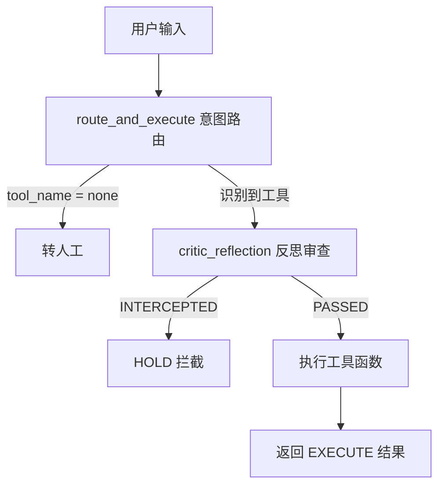

# CopilotAgent 架构说明

> 源码位置：`backend/app/agent.py`  
> 配套评估：`backend/app/eval.py`

这是一个**电商客服 Copilot Agent 的简化 Demo**，演示 Agentic AI 的三个核心环节：工具调用（Tool Use）、意图路由（Router）、反思风控（Reflection）。

---

## 整体架构



---

## 1. 工具函数（Tools）

两个模拟的业务工具，对应真实场景里的 Function Calling：

| 函数 | 作用 | 说明 |
|------|------|------|
| `fetch_order_status(order_id)` | 查询订单物流状态 | 生产环境应对接 ERP 或 RPA Webhook |
| `apply_refund(order_id, amount)` | 发起退款申请 | 当前为硬编码返回字符串 |

---

## 2. CopilotAgent 类

### 2.1 `route_and_execute` — 意图路由（模拟 LLM）

用**关键词规则**模拟大模型的 Function Calling 输出，返回结构与真实 LLM 的 tool call JSON 一致：

```python
{"tool_name": "...", "tool_params": {...}}
```

**路由规则：**

| 用户输入特征 | 选中工具 | 参数 |
|-------------|---------|------|
| 含「订单」且含「退款」 | `apply_refund` | `order_id`, `amount` |
| 含「查」或「物流」 | `fetch_order_status` | `order_id` |
| 均不匹配 | `none` | `{}` |

**示例：**

- `"帮我看看订单号 987654 现在的物流到哪了？"` → `fetch_order_status`
- `"帮我把订单 987654 退款 200 元"` → `apply_refund`

---

### 2.2 `critic_reflection` — 反思 / 风控层

在执行危险操作前做**合规检查**，对应 Agent 架构中的 Reflection / Guardrail 模式。

**规则：**

- 工具为 `apply_refund` 且退款金额 **> 100 元** → 返回 `INTERCEPTED`，需人工审批
- 其余情况 → 返回 `PASSED`，允许继续执行

**拦截返回示例：**

```python
{
    "status": "INTERCEPTED",
    "reason": "反思层拦截: 退款金额 (200.0元) 超过安全阀值, 需主管审批.",
    "action_required": "MANUAL_APPROVE"
}
```

---

### 2.3 `run` — 主执行链路

将路由与反思串联为完整 Agent 流程：

1. **路由** — 调用 `route_and_execute`，得到 `intent`
2. **无法识别** — `tool_name == "none"` 时，返回转人工消息
3. **反思审查** — 调用 `critic_reflection`；若被拦截，返回 `HOLD` 决策，不执行工具
4. **执行工具** — 审查通过后，调用对应工具函数，返回 `EXECUTE` 决策及结果

**返回值类型：**

| 场景 | 返回结构 |
|------|---------|
| 无法识别 | `{"output": "未能识别有效指令, 已转交人工客服"}` |
| 风控拦截 | `{"decision": "HOLD", "tool_intent": {...}, "msg": "..."}` |
| 正常执行 | `{"decision": "EXECUTE", "output": "..."}` |

---

## 3. 模块与设计概念对照

| 代码模块 | 对应 Agentic AI 概念 |
|---------|---------------------|
| `fetch_order_status` / `apply_refund` | Tool / Function Calling |
| `route_and_execute` | LLM Router + Tool Use |
| `critic_reflection` | Reflection / 安全卡点 |
| `run` | Agent 编排（Orchestration） |

---

## 4. 与评估流水线（eval.py）的关系

`backend/app/eval.py` 使用**黄金数据集（Golden Dataset）**对 `route_and_execute` 进行自动化评估：

- 对比实际输出的 `tool_name` 与 `tool_params` 是否与期望值一致
- 统计**工具调用准确率**（核心指标）
- 失败用例写入**错误分析矩阵**，区分：
  - `Reasoning Error` — 工具选错
  - `Extraction Error` — 工具选对但参数提取错误

**运行方式：**

```bash
cd backend/app
python eval.py
```

---

## 5. 当前局限与后续演进

| 局限 | 说明 |
|------|------|
| 路由靠关键词 | 非真实 LLM，无法处理复杂语义 |
| 参数硬编码 | `order_id`、`amount` 固定为 `987654` / `200.0`，未从用户输入动态提取 |
| LLM 未接入 | `__init__` 中的 `mock_llm_client` 尚未使用 |

**演进方向：**

1. 接入真实 LLM（OpenAI / DeepSeek）做 Function Calling
2. 从用户输入中动态抽取 `order_id`、`amount` 等参数
3. 扩展反思规则（频率限制、黑名单、多轮确认等）
4. 将 `eval.py` 的黄金数据集扩展为持续回归测试集
