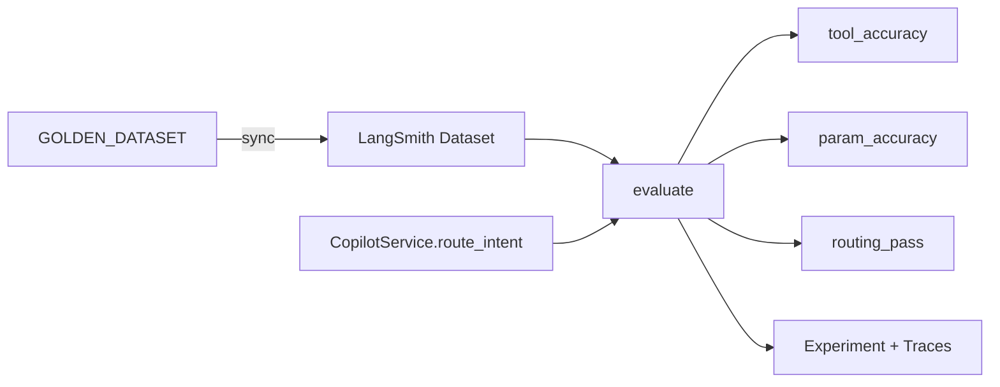

# LangSmith Copilot 评估体系说明


> 源码位置：`backend/app/eval_dataset.py`、`backend/app/evaluators.py`、`backend/app/eval_runner.py`、`backend/app/eval.py`  
> 评估对象：`CopilotService.route_intent`（工具路由 + 参数提取).

本文档说明如何将 Copilot 工具路由评估迁移到 **LangSmith Datasets + Evaluators**，在 LangSmith Console 中批量跑实验、查看准确率、关联 trace 做 Error Analysis.


---

## 1. 评估目标


| 指标      | Evaluator Key    | 说明                                      |
| ------- | ---------------- | --------------------------------------- |
| 工具选择准确率 | `tool_accuracy`  | 预测 `tool_name` 是否等于 `expected_tool`     |
| 参数提取准确率 | `param_accuracy` | 预测 `tool_params` 是否匹配 `expected_params` |
| 综合通过率   | `routing_pass`   | 上述两项同时通过                                |


错误分类（本地报告 / `routing_pass` comment):

- **Reasoning Error** — 工具选错.
- **Extraction Error** — 工具选对但参数错.

---

## 2. 黄金数据集

数据集定义在 `backend/app/eval_dataset.py` 的 `GOLDEN_DATASET`，默认同步到 LangSmith Dataset：`copilot-tool-routing-golden`。


| ID  | 场景             | expected_tool                    |
| --- | -------------- | -------------------------------- |
| 1   | 订单物流查询         | `fetch_order_status`             |
| 2   | 退款申请           | `apply_refund`                   |
| 3   | 订单号变体          | `fetch_order_status`             |
| 4   | SOP 政策咨询       | `query_sop_knowledge`            |
| 5   | ShadowBot 物流穿透 | `call_shadowbot_fetch_logistics` |
| 6   | 普通闲聊（不应调工具）    | `None`                           |


LangSmith example 结构：

```json
{
  "inputs": {"input": "帮我看看订单号 987654 现在的物流到哪了？"},
  "outputs": {
    "expected_tool": "fetch_order_status",
    "expected_params": {"order_id": "987654"}
  },
  "metadata": {"case_id": 1}
}
```

**参数匹配规则**：

- `order_id`、`amount` — 精确匹配（数值允许 `int` / `float` 等价）
- `query` — 只要求 LLM 返回**非空字符串**（允许改写原意）

---

## 3. 架构




Target 函数输出：

```python
{
    "tool_name": "fetch_order_status",  # 或 None
    "tool_params": {"order_id": "987654"}
}
```

每次 eval run 会在 LangSmith 产生 **Experiment**，各 case 的 LLM 调用可通过 trace 关联到 `copilot_route_with_tools`.


---


## 4. 配置

`backend/.env`：

```bash
LANGCHAIN_TRACING_V2=true
LANGCHAIN_API_KEY=lsv2_你的key
LANGCHAIN_PROJECT=agentic-ai-copilot
LANGSMITH_EVAL_DATASET=copilot-tool-routing-golden
# 跑真实 LLM 评估还需要
ZHIPU_API_KEY=你的智谱key
```


| 变量                       | 说明                                          |
| ------------------------ | ------------------------------------------- |
| `LANGCHAIN_API_KEY`      | LangSmith API Key（必填）                       |
| `LANGSMITH_EVAL_DATASET` | Dataset 名称，默认 `copilot-tool-routing-golden` |
| `ZHIPU_API_KEY`          | 调用真实模型做路由评估                                 |


---

## 5. 运行方式

在 `backend/` 目录下执行：

```bash
# 1. 仅同步 Dataset 到 LangSmith
python -m app.eval --mode sync

# 2. 跑 LangSmith Experiment（默认：先 sync 再 evaluate）
python -m app.eval --mode langsmith --experiment-prefix copilot-routing

# 3. 本地离线报告（不调 LangSmith API，但默认仍会调 LLM）
python -m app.eval --mode local
```

常用参数：


| 参数                    | 说明                              |
| --------------------- | ------------------------------- |
| `--mode langsmith`    | 在 LangSmith 上跑 batch experiment |
| `--mode local`        | 终端打印本地报告                        |
| `--mode sync`         | 只上传/更新 Dataset                  |
| `--experiment-prefix` | Experiment 名称前缀                 |
| `--dataset-name`      | 覆盖默认 Dataset 名                  |
| `--no-sync`           | 跳过 eval 前的 dataset 同步           |
| `--max-concurrency`   | 并发数，默认 2                        |


---

## 6. 在 LangSmith 查看结果

1. 打开 [LangSmith Console](https://smith.langchain.com) → **Datasets** → `copilot-tool-routing-golden.`
2. 进入 **Experiments**，找到 `copilot-routing-`* 实验.
3. 查看各 Evaluator 分数：`tool_accuracy`、`param_accuracy`、`routing_pass.`
4. 点击失败 case 的 run → 查看 `copilot_route_with_tools` trace，分析 Reasoning / Extraction 错误.


---

## 7. 本地单元测试

不依赖 LangSmith / 智谱 API：

```bash
cd backend
pytest tests/test_evaluators.py tests/test_eval_runner.py -q
```

- `test_evaluators.py` — 纯函数 evaluator 逻辑
- `test_eval_runner.py` — 注入 mock `route_fn` 的本地评估流水线

---


## 8. 扩展 Dataset

编辑 `backend/app/eval_dataset.py` 中的 `GOLDEN_DATASET`，然后：

```bash
python -m app.eval --mode sync
python -m app.eval --mode langsmith
```

新增 case 建议覆盖：

- 边界退款金额 (100 / 101 元，用于后续扩展风控 eval)
- 多工具歧义输入
- 应走 RAG 而非 tool 的模糊政策问句

---

## 9. 与 Trace 的关系

评估运行时建议开启 `LANGCHAIN_TRACING_V2=true`.

- 每个 case 的 `route_intent` → `route_with_tools` 会产生 trace.
- Experiment 中失败 case 可直接跳转 trace,替代手写 Error Analysis Matrix.

相关文档：[LangSmith Copilot Trace 接入说明](./LangSmith-Copilot-Trace接入说明.md)