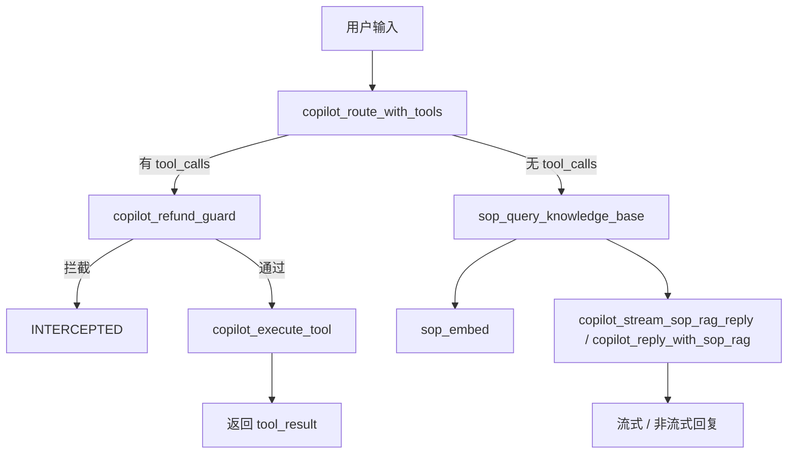

# LangSmith Copilot Trace 接入说明

> 源码位置：`backend/app/services/copilot_service.py`、`backend/app/rag_service_sop.py`、`backend/app/observability.py`  
> 配置入口：`backend/app/config.py`、`backend/.env`

本文档说明如何在 `backend/app/` 中通过 [LangSmith](https://smith.langchain.com) 观测 **Copilot 多步编排链路**（工具路由 → 风控 → 工具执行 / SOP RAG 回复），便于调试 prompt、分析工具选错原因、评估 RAG 检索质量.

---

## 1. 背景与目标

Copilot 服务使用原生 OpenAI SDK（智谱 GLM 兼容接口），不走 LangChain Agent，因此**无法仅靠环境变量**自动获得完整 trace 树。当前方案采用两层 instrumentation：


| 层级                 | 手段            | 作用                                |
| ------------------ | ------------- | --------------------------------- |
| 业务编排               | `@traceable`  | 记录路由、风控、工具执行、RAG 检索等步骤            |
| LLM / Embedding 调用 | `wrap_openai` | 自动记录 model、messages、token、latency |


关闭 tracing 时，`@traceable` 基本为 no-op，且不会包装 OpenAI client，对正常运行几乎无影响。

---

## 2. 架构与 Trace 树

### 2.1 Copilot 执行流程




### 2.2 LangSmith 中的 Trace 结构

**工具调用分支**（`/api/copilot/sse` 流式入口）：

```
copilot_stream (chain)
├── copilot_route_with_tools (llm)
│   └── ChatCompletion            ← wrap_openai 自动记录
├── copilot_refund_guard (chain)  ← 可选
└── copilot_execute_tool (tool)
```

**SOP RAG 回复分支**：

```
copilot_stream (chain)
├── copilot_route_with_tools (llm)
├── sop_query_knowledge_base (retriever)
│   └── sop_embed (embedding)
│       └── Embeddings API        ← wrap_openai 自动记录
└── copilot_stream_sop_rag_reply (llm)
    └── ChatCompletion (stream)   ← wrap_openai 自动记录
```

**非流式入口** `copilot_chat (chain)` 结构相同，顶层 run 名为 `copilot_chat`。

---

## 3. 涉及文件


| 文件                                        | 改动说明                                     |
| ----------------------------------------- | ---------------------------------------- |
| `backend/app/observability.py`            | 启动时写入 LangSmith 环境变量                     |
| `backend/app/config.py`                   | 读取 tracing 开关、API Key、Project 名称         |
| `backend/app/main.py`                     | 在创建 Service 前调用 `configure_langsmith()`  |
| `backend/app/services/copilot_service.py` | Copilot 编排层 `@traceable` + `wrap_openai` |
| `backend/app/rag_service_sop.py`          | SOP 检索 / Embedding 层 trace               |
| `backend/requirements.txt`                | 新增 `langsmith` 依赖                        |
| `backend/.env.example`                    | LangSmith 配置示例                           |


### 3.1 `@traceable` 方法对照表


| 方法                                     | run_type  | 说明                  |
| -------------------------------------- | --------- | ------------------- |
| `CopilotService.chat`                  | chain     | 非流式 Copilot 顶层入口    |
| `CopilotService.stream`                | chain     | SSE 流式 Copilot 顶层入口 |
| `CopilotService.route_with_tools`      | llm       | LLM 工具路由决策          |
| `CopilotService.check_refund_guard`    | chain     | 反思 / 风控层            |
| `CopilotService.execute_tool`          | tool      | 工具执行                |
| `CopilotService.reply_with_sop_rag`    | chain     | SOP RAG 非流式回复       |
| `CopilotService._stream_sop_rag_reply` | llm       | SOP RAG 流式生成        |
| `SopRagService.query_knowledge_base`   | retriever | Chroma 向量检索         |
| `SopRagService.embed`                  | embedding | 文本向量化               |


---

## 4. 配置与启用

### 4.1 安装依赖

```bash
cd backend
pip install -r requirements.txt
```

### 4.2 环境变量

在 `backend/.env` 中配置：

```bash
LANGCHAIN_TRACING_V2=true
LANGCHAIN_API_KEY=lsv2_你的key
LANGCHAIN_PROJECT=agentic-ai-copilot
```


| 变量                     | 必填  | 说明                                         |
| ---------------------- | --- | ------------------------------------------ |
| `LANGCHAIN_TRACING_V2` | 是   | 设为 `true` 开启 tracing                       |
| `LANGCHAIN_API_KEY`    | 是   | LangSmith API Key（也支持 `LANGSMITH_API_KEY`） |
| `LANGCHAIN_PROJECT`    | 否   | 项目名，默认 `agentic-ai-copilot`                |


建议按环境区分 project，例如：

- `agentic-ai-dev` — 本地开发
- `agentic-ai-staging` — 预发
- `agentic-ai-prod` — 生产

### 4.3 启动服务

```bash
cd backend
uvicorn app.main:app --reload
```

启动顺序：`get_settings()` → `configure_langsmith(settings)` → 初始化 `RagService` / `ChatService`。确保 tracing 在任何 Copilot 请求之前生效。

---

## 5. 验证方式

1. 确认 `.env` 中 tracing 已开启且 API Key 有效。
2. 调用 Copilot 接口，例如：

```bash
# SSE 流式（已接入 trace）
curl -N -X POST http://localhost:8000/api/copilot/sse \
  -H "Content-Type: application/json" \
  -d '{"user_input": "帮我查一下订单 987654 的物流"}'

# 非流式（已接入 trace，经 CopilotService.chat）
curl -X POST http://localhost:8000/api/copilot/chat \
  -H "Content-Type: application/json" \
  -d '{"user_input": "TikTok 退货运费谁承担？"}'
```

1. 打开 [LangSmith Console](https://smith.langchain.com)，进入 `LANGCHAIN_PROJECT` 对应项目，查看最新 trace run。

---

## 6. 覆盖范围与未接入部分

### 已接入

- `/api/copilot/sse` → `CopilotService.stream`
- `CopilotService.chat`（可被非流式 Copilot 逻辑复用）
- SOP 知识库检索与 Embedding（`SopRagService`）

### 暂未接入


| 模块                                             | 原因                                                                               |
| ---------------------------------------------- | -------------------------------------------------------------------------------- |
| `main.py` 中 `/api/copilot/chat` 的旧内联 OpenAI 逻辑 | 与 `CopilotService` 重复，使用独立 client，未走 trace                                       |
| `chat_service.py`（`/api/chat`）                 | 走 LangChain `ChatOpenAI`，仅需开环境变量即可自动 trace，无需 `@traceable`                       |
| `eval.py` golden dataset 评估                    | 已迁移至 LangSmith Datasets + Evaluators，见 [评估体系文档](./LangSmith-Copilot-Eval评估体系.md) |


---

## 7. 后续扩展建议

### Phase 1（已完成）

- Copilot 业务步骤 `@traceable`
- OpenAI client `wrap_openai`
- 统一 observability 配置

### Phase 2（可选）

- 将 `main.py` 中重复的 `/api/copilot/chat` 逻辑收敛到 `CopilotService.chat`，避免双份实现
- 在 trace metadata 中附加 `session_id`、`endpoint` 等字段，便于按会话筛选

### Phase 3（已完成）

- 将 `eval.py` 的 `GOLDEN_DATASET` 迁移为 LangSmith Dataset
- 对 `route_with_tools` / `route_intent` 运行 batch evaluation，统计工具路由准确率
- 失败 case 通过 LangSmith Experiment 关联 trace，做 Error Analysis

详见 [LangSmith Copilot Eval 评估体系](./LangSmith-Copilot-Eval评估体系.md)。

---

## 8. 常见问题

**Q: 开了 tracing 但 LangSmith 没有数据？**

- 检查 `LANGCHAIN_TRACING_V2=true`（值为字符串 `true`，不是 `1`）
- 确认 API Key 正确，且网络可访问 LangSmith
- 确认请求走的是 `CopilotService`，而非 `main.py` 内联逻辑

**Q: 只有 LLM 调用，没有 tool / retriever 子节点？**

- 可能是 `@traceable` 父 run 未正确嵌套，检查是否在 `configure_langsmith()` 之后才创建 `CopilotService` 单例
- 重启服务后再试（单例在首次请求时创建）

**Q: 生产环境是否需要脱敏？**

- 客服对话可能含订单号、金额等 PII，生产环境建议采样上报或对 trace input/output 做脱敏处理

**Q: Chat 接口如何 trace？**

- `/api/chat` 使用 LangChain，开启相同环境变量即可，无需额外代码。可在 LangSmith 中为 Chat 与 Copilot 配置不同 `LANGCHAIN_PROJECT` 区分（需按请求动态切换 project，当前未实现）。

